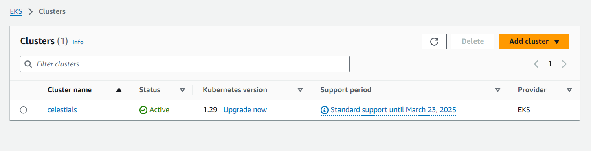
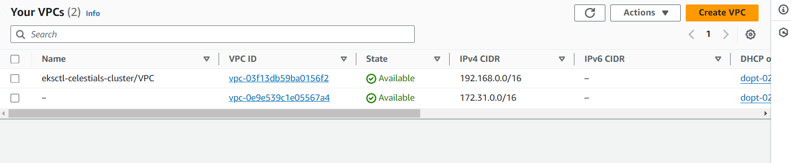
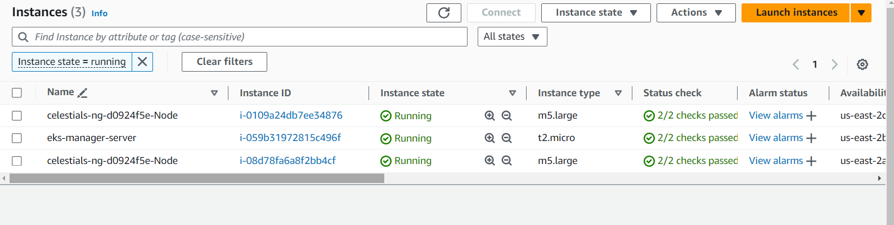
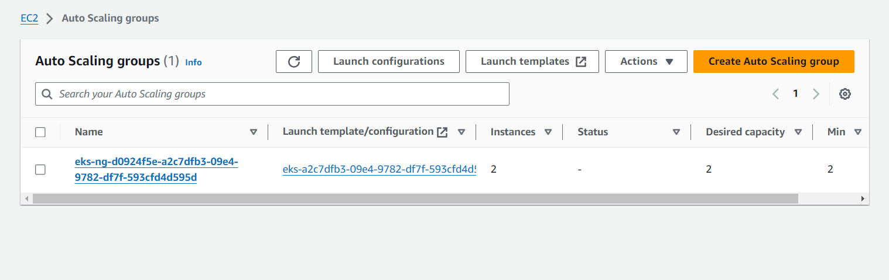
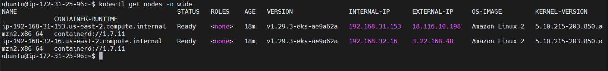
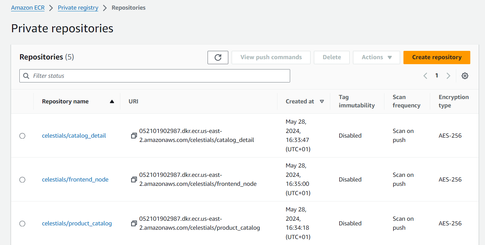

# AWS EKS and App Mesh

In this project, we will create a single Node EKS cluster. After that, we will install AWS App Mesh. We will deploy a sample polyglot application and implement traffic routing and mutual TLS authentication. Lastly, we will use the X-Ray service to trace the communication between individual services.


# Deploying an EKS Cluster

We will be deploying an EKS cluster using a CLI utility called `eksctl`. Then, we will access the endpoint using `kubectl`, which is a command-line binary to access Kubernetes resources.

1. Create an eks-manager-server instance on aws (ubuntu, t2.micro)

2. SSH into the instance

3. Install unzip to be used in the next command:

```sh
sudo apt update -y
sudo apt install unzip -y
```

5. Install aws cli following linux instructions: https://docs.aws.amazon.com/cli/latest/userguide/getting-started-install.html

6. Go to IAM and create a user with access permissions as defined here: https://eksctl.io/installation/#prerequisite

7. Configure the eks-manager-server instance with the credentials of the newly created user

8. Follow the installation process here: https://eksctl.io/installation/#for-unix to install the `eksctl` cli binary

9. Do `eksctl version` to confirm

10. We will create an ec2 key pair so that we can use that key pair to SSH into a worker Node if required:

```sh
aws ec2 create-key-pair --key-name celestial --region us-east-2 > celestial.pem
```

11. Once we have a key pair, we will create an EKS cluster using eksctl. For now, we are creating a public endpoint EKS cluster.

```sh
eksctl create cluster --name celestials --region us-east-2 --with-oidc --ssh-access --ssh-public-key celestial --managed
```

The preceding command will show the status in `stdout`, but in parallel, it will create a CloudFormation stack (Confirm on the CloudFormation console), which basically spins up all the resources required for an EKS cluster, for example, a VPC, a security group, worker Node group, the EKS control plane, service accounts, etc.









Navigate to the EKS console to see the status of the EKS cluster.


At the end of `stdout`, eksctl will create a config file in the `~/.kube` folder. This config file includes the access token and endpoint of the EKS cluster. 

To connect to the EKS cluster, we will be using the `kubectl` CLI tool, which reads the config file and connects to the EKS cluster

12. Install kubectl on the linux server following https://kubernetes.io/docs/tasks/tools/install-kubectl-linux/ using the binary with curl approach

13. Run the following commands:

```sh
chmod +x kubectl
sudo mv kubectl /usr/local/bin/
kubectl version
```

In the preceding `kubectl version` command, we got the client and server version information, which means we can connect to the EKS endpoint.

To get the Nodes information, execute the following command:

```sh
kubectl get nodes -o wide
```



We have successfully created an EKS cluster.


# Deploying an application (Product Catalog) on EKS

We will be deploying an application that comprises three microservices.

The three microservices are as follows:

  - **Frontend**: This service (`frontend-Node`) shows the UI for the Product Catalog functionality. It has been developed in `Node.js` with `ES templating`.

  - **Backend**: The backend is a REST API service (`prodcatalog`), developed in Python Flask, that does the following operations:

    - Adds a product to the catalog
    - Gets the product from the catalog
    - Gets the catalog details from the `proddetail` service
  
  - **Catalog details backend**: This is also a REST API service (`proddetail`), developed in Node.js, and is used to get the catalog details.

Perform the following steps to deploy the application on EKS:

1. Clone the following repository to your terminal, from where you can also access EKS cluster:

```sh
git clone https://github.com/uedwinc/aws_eks-and-app_mesh.git

cd aws_eks-and-app_mesh
```

2. Export AWS variables so that they're available when we execute AWS related commands:

```sh
export ACCOUNT_ID=<YOUR AWS ACCOUNT ID>
export AWS_REGION=us-east-2
export PROJECT_NAME=celestials
```

3. Now we need to create a namespace where we will deploy our services. We also need to create an Identity and Access Management (IAM) role and a service account for this namespace so that any resources in this namespace will have permission to provide the data to AWS X-Ray:

```sh
kubectl create namespace prodcatalog-ns

aws iam create-policy --policy-name ProdEnvoyNamespaceIAMPolicy --policy-document file://deployment/envoy-iam-policy.json

eksctl create iamserviceaccount --cluster celestials --namespace prodcatalog-ns --name prodcatalog-envoy-proxies --attach-policy-arn arn:aws:iam::$ACCOUNT_ID:policy/ProdEnvoyNamespaceIAMPolicy --override-existing-serviceaccounts --approve

# You can see the detail of service account
kubectl describe sa prodcatalog-envoy-proxies -n prodcatalog-ns
```

4. Next, we need to install docker following instructions here: https://docs.docker.com/engine/install/ubuntu/

  - Do `docker --version` to confirm

5. The next thing we need to do is to build the services and create a Docker image, and after that, push it into Elastic Container Registry (ECR). We will tag the Docker image with the application version:

```sh
# Login to ECR
aws ecr get-login-password --region $AWS_REGION | sudo docker login --username AWS --password-stdin $ACCOUNT_ID.dkr.ecr.$AWS_REGION.amazonaws.com

# Export APP_VERSION
export APP_VERSION=1.0

# Loop through each application
for app in catalog_detail product_catalog frontend_node; do
  # Check if the repository exists, if not, create it
  aws ecr describe-repositories --repository-name "$PROJECT_NAME/$app" >/dev/null 2>&1 || \
  aws ecr create-repository --repository-name "$PROJECT_NAME/$app" >/dev/null
  
  # Set the target repository URL
  TARGET="$ACCOUNT_ID.dkr.ecr.$AWS_REGION.amazonaws.com/$PROJECT_NAME/$app:$APP_VERSION"
  
  # Build the Docker image
  sudo docker build -t "$TARGET" "apps/$app"
  
  # Push the Docker image to ECR
  sudo docker push "$TARGET"
done
```

Once you are done with the preceding steps, you will be able to see the Docker images in ECR.



6. Now deploy the application in the EKS cluster:

```sh
envsubst < ./deployment/deploy_app.yaml | kubectl apply -f -
```

7. Once all the services are deployed, you can verify that using the following commands:

```sh
kubectl get deployments -n prodcatalog-ns

kubectl get pods -n prodcatalog-ns

kubectl get services -n prodcatalog-ns
```

8. To verify that the application is working fine, we can do a remote session inside the frontend Pod and try to access the `prodcatalog` service:

```sh
frontendpod=$(kubectl get pods -n prodcatalog-ns -l app=frontend-node -o jsonpath='{.items[].metadata.name}')

kubectl exec -it $frontendpod -c frontend-node -n prodcatalog-ns bash

# Inside the frontend-node pod:
curl http://prodcatalog.prodcatalog-ns.svc.cluster.local:5000/products/
# This should return a json with "products" as empty dictionary and "details" including version = 1 and "vendors" as ABC.com
```

9. To test the connectivity from the prodcatalog service to `proddetail`, connect to the `prodcatalog` Pod and curl to `proddetail`

```sh
prodcat=$( kubectl get pods -n prodcatalog-ns -l app=prodcatalog -o jsonpath='{.items[].metadata.name}')

kubectl exec -it $prodcat -c prodcatalog -n prodcatalog-ns bash

# Inside the prodcatalog pod
curl http://proddetail.prodcatalog-ns.svc.cluster.local:3000/catalogDetail
#This should return a json similar to: {"version":"1","vendors":["ABC.com"]}
```

We have successfully deployed an application with three services.

# Implementing traffic management

We will enable a mesh in the EKS cluster. After that, we will create an App Mesh component, virtual service, virtual node, virtual router, and virtual gateway. We will also create another version of a service and perform weight-based traffic routing.

## Installing the App Mesh controller

The following diagram shows the traffic flow if we enable App Mesh and create all of its components:

(...)

Perform the following steps to create an App Mesh controller in an EKS cluster:

1. We will install the App Mesh controller on the EKS cluster using the Helm CLI. So, we need to install the Helm binary:

```sh
curl -sSL https://raw.githubusercontent.com/helm/helm/master/scripts/get-helm-3 | bash

helm version --short
```

2. Once Helm is installed, add the EKS charts repository:

```sh
helm repo add eks https://aws.github.io/eks-charts
```

3. We will create a namespace where will install the App Mesh controller, then after that, we will do some pre-configuration, which includes creating `Custom Resource Definitions (CRDs)`, creating an IAM role, and tying it to the service account with the namespace, so that the App Mesh controller has the required permissions to interact with other AWS services:

```sh
# Create the namespace
kubectl create ns appmesh-system

# Install the App Mesh CRDs
kubectl apply -k "github.com/aws/eks-charts/stable/appmesh-controller/crds?ref=master"

# Download the IAM policy for AWS App Mesh Kubernetes Controller
curl -o controller-iam-policy.json https://raw.githubusercontent.com/aws/aws-app-mesh-controller-for-k8s/master/config/iam/controller-iam-policy.json

# Create an IAM policy called AWSAppMeshK8sControllerIAMPolicy
aws iam create-policy \
--policy-name AWSAppMeshK8sControllerIAMPolicy \
--policy-document file://controller-iam-policy.json

# Create an IAM role for the appmesh-controller service account
eksctl create iamserviceaccount --cluster celestials \
--namespace appmesh-system \
--name appmesh-controller \
--attach-policy-arn arn:aws:iam::$ACCOUNT_ID:policy/AWSAppMeshK8sControllerIAMPolicy \
--override-existing-serviceaccounts \
--approve
```

4. Install the App Mesh controller using helm chart. We are also enabling X-Ray tracing

```sh
helm upgrade -i appmesh-controller eks/appmesh-controller \
--namespace appmesh-system \
--set region=$AWS_REGION \
--set serviceAccount.create=false \
--set serviceAccount.name=appmesh-controller \
--set tracing.enabled=true \
--set tracing.provider=x-ray
```

5. Confirm all the CRDs and resources are created in the appmesh-system namespace:

```sh
kubectl get crds | grep appmesh

kubectl -n appmesh-system get all
```

At this stage, we have successfully installed an App Mesh controller on the EKS cluster. Now we port the Product Catalog application on App Mesh. But before that, we should understand the challenge that we are facing with the application and how App Mesh can overcome that challenge.

> Currently, the Product Catalog application's `frontend-node` service is hardwired to make requests to the `prodcatalog` service and the `prodcatalog` service is hardwired to make requests to `proddetail` . So, every time we have to release a new version of the `proddetail` service, we have to release a new version of the `prodcatalog` service too to support both the new and old versions to point to its version-specific service endpoints. This works, but it's not optimal to maintain for the long term.

> A more optimal way is to use a virtual service of the `proddetail` service and deploy the new version of `proddetail` (v2 being the new and v1 being the currently deployed one), and then route the traffic from `prodcatalog` to `proddetail` v1 incrementally to `proddetail` v2. Once we see that traffic flow is happening properly and the application is working fine with `proddetail` v2, then we will delete `prodetail` v1.

We will port the application on App Mesh by creating App Mesh resources, and then perform the previously mentioned configuration by taking the following steps:

1. Create the mesh in an EKS cluster. We also need to label the `prodcatalog-ns` namespace with annotations:

```sh
kubectl apply -f deployment/mesh.yaml
```

2. You can confirm the mesh creation using the CLI as well as the UI:

```sh
kubectl describe mesh prodcatalog-mesh
```

You can see that the mesh is available in the AWS App Mesh console:

(...)

3. Create the App Mesh resources (virtual service, virtual node, and virtual router):

```sh
kubectl apply -f deployment/meshed_app.yaml

kubectl get virtualnode,virtualservice,virtualrouter -n prodcatalog-ns
```

The following figure shows all three resources are also visible in the App Mesh console:

(...)

4. Since we have already enabled the mesh and created the mesh resources, any workload resource that gets spun up in the prodcatalog-ns namespace will have a proxy sidecar along with it. But since we created our resources before we enabled the service mesh, we have to restart the deployment to get the proxy sidecar along with the application Pods:

```sh
kubectl -n prodcatalog-ns rollout restart deployment prodcatalog

kubectl -n prodcatalog-ns rollout restart deployment proddetail

kubectl -n prodcatalog-ns rollout restart deployment frontend-node
```

5. We can verify the number of Pods in a deployment. Before restarting, the number of Pods would be 1/1, but after restarting the deployment will have three Pods, where one is the application Pod, one is the Envoy proxy, and one is the X-Ray agent

(...)

6. We need to create a virtual gateway, which will create an ingress service and expose it as the load balancer type. We will use the AWS network load balancer to route the external internet traffic:

```sh
kubectl apply -f deployment/virtual_gateway.yaml
```

7. We can access the application via `loadbalancer` created through the ingress service:

```sh
export LB_NAME=$(kubectl get svc ingress-gw -n prodcatalog-ns -o jsonpath="{.status.loadBalancer.ingress[*].hostname}")

echo $LB_NAME
```

8. Access the `loadbalancer` endpoint in the browser and you will be able to access the application.

(...)

- Add products:

(...)

9. Now let's deploy v2 of the *proddetail* service and distribute 50% of the traffic from v1 to v2. Go to the same folder where our application exists and run the following command to create a v2 Docker image and push it to ECR so that we can deploy on an EKS cluster:

```sh
aws ecr get-login-password --region $AWS_REGION | docker login --username AWS --password-stdin $ACCOUNT_ID.dkr.ecr.$AWS_REGION.amazonaws.com

PROJECT_NAME=celestials

export APP_VERSION_2=2.0

for app in catalog_detail; do
  aws ecr describe-repositories --repository-name $PROJECT_NAME/$app >/dev/null 2>&1 || \
  aws ecr create-repository --repository-name $PROJECT_NAME/$app >/dev/null
  TARGET=$ACCOUNT_ID.dkr.ecr.$AWS_REGION.amazonaws.com/$PROJECT_NAME/$app:$APP_VERSION_2
  cd apps/$app
  sudo docker build -t $TARGET -f version2/Dockerfile .
  sudo docker push $TARGET
done
```

10. Deploy the `proddetail-v2` service as well as the `appmesh` canary configuration to distribute the traffic:

```sh
envsubst < ./deployment/canary.yaml | kubectl apply -f -
```

11. Now we can verify the equal traffic distribution between v1 and v2 by again refreshing the `loadbalancer` endpoint. You can see a new button for the canary deployment. Click on the Canary Deployment button for couple of time you will be able to see different vendor name which is configured in proddetail-v2 service.

(...)

We have installed an App Mesh controller and ported an application into App Mesh. We then deployed v2 of the proddetail service and distributed half of the traffic between v1 and v2. Now, to trace the traffic flow between all the services, we can use the AWS X-Ray service.

